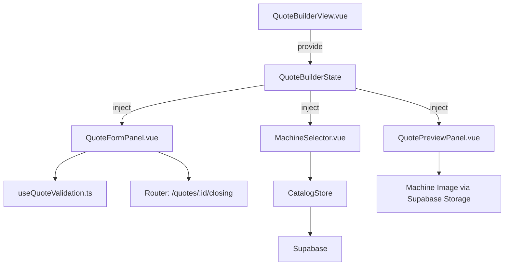

# Design Document: Quote Generator Enhancements

## Overview

This design covers 18 enhancements to the Vue 3 Quote Generator to achieve full parity with the original ESPMI Sales Portal. The changes fall into five categories:

1. **New form fields** (Requirements 1–4): Email, date, salutation, opening line
2. **Machine section enhancements** (Requirements 5–6, 14, 17–18): Unit condition override, sub-model selector, machine image, condition display, date display
3. **Toggleable package items** (Requirements 7–11): Delivery toggle, computer set toggle, inclusions/exclusions/add-ons with enable/disable and custom entries
4. **Warranty and closing text** (Requirements 12, 15): Warranty section fields, closing paragraph and signature formatting
5. **Validation and navigation** (Requirements 13, 16): Pre-PDF validation engine, closing documents button

The design minimizes changes to existing working functionality by extending the `QuoteBuilderState` interface with new properties and introducing wrapper types for toggling, rather than replacing the existing data structures.

## Architecture

The existing architecture remains intact: a shared reactive `QuoteBuilderState` object (via `provide`/`inject`) connecting `QuoteFormPanel` and `QuotePreviewPanel`. The enhancements extend this pattern:



**Key architectural decisions:**

1. **No new stores or composables for state** — all new fields go directly into `QuoteBuilderState` to maintain the single-source-of-truth pattern
2. **New composable `useQuoteValidation`** — extracted validation logic (pure function) used by both the PDF export flow and the closing documents button
3. **Toggleable items use a wrapper type** — `ToggleableItem` wraps existing catalog items with an `enabled` boolean, keeping the original `MachineInclusion`/`MachineExclusion`/`MachineAddon` types unchanged
4. **Sub-model selection is a two-step filter** — the existing `MachineSelector` already matches on `brand + model + sub_model`; we separate the sub-model into its own dropdown

## Components and Interfaces

### Modified Components

#### `useQuoteBuilder.ts` — Extended State Interface

New properties added to `QuoteBuilderState`:

```typescript
// Client info additions (Req 1–4)
email: string
quoteDate: string          // ISO date string, defaults to today
salutation: string         // defaults to "Dear Ma'am / Sir,"
openingLine: string        // defaults to standard intro text

// Machine section (Req 5–6)
selectedSubModel: string   // separate sub-model selection
imageKey: string | null    // image storage key from catalog

// Toggleable package items (Req 7–11)
inclusionItems: ToggleableItem[]    // replaces simple inclusions display
exclusionItems: ToggleableItem[]    // replaces simple exclusions display
addonItems: ToggleableItem[]        // replaces simple addons display
includeDelivery: boolean            // delivery toggle (Req 7)
includeComputerSet: boolean         // computer set toggle (Req 8)
computerSetSpec: string             // custom spec text when computer set is included
hasComputerSetOption: boolean       // from catalog data

// Warranty (Req 12)
warrantyCompany: string             // selected company name
warrantySupplier: string            // defaults to "ESPMI"
warrantyMachineDuration: string     // from catalog (e.g., "1 year")
warrantyPrintheadDuration: string   // from catalog (nullable)

// Validation state (Req 13, 16)
validationErrors: string[]          // populated by validation engine
```

#### `ToggleableItem` — New Interface

```typescript
interface ToggleableItem {
  id: string
  description: string
  enabled: boolean
  isCustom: boolean        // true for user-added items
  sortOrder: number
}
```

This wraps catalog items (`MachineInclusion`, `MachineExclusion`, `MachineAddon`) with toggle state. Catalog-sourced items default to `enabled: true` for inclusions/exclusions and `enabled: false` for add-ons (per requirements). Custom items are always `enabled: true` on creation.

#### `MachineSelector.vue` — Sub-Model Enhancement (Req 6)

Current behavior concatenates `model + sub_model` into a single dropdown. The enhancement splits this into:
1. **Model dropdown**: shows unique model names for the selected brand
2. **Sub-Model dropdown** (conditional): appears only when the selected model has multiple entries with different `sub_model` values

```typescript
// Derived computed properties
const uniqueModels = computed(() => {
  // Unique model names for selected brand
})

const subModels = computed(() => {
  // sub_model values for selected brand+model combination
  // Returns empty if only one entry (no sub-model variants)
})

const showSubModelDropdown = computed(() => subModels.value.length > 1)
```

#### `QuoteFormPanel.vue` — New Sections

New form sections added (in order):
1. **Email field** in Client Information grid (alongside Contact)
2. **Date picker** in Client Information grid
3. **Salutation** text input below Client Information
4. **Opening Line** textarea below Salutation
5. **Unit Condition override** dropdown in Machine section (after MachineSelector)
6. **Delivery toggle** checkbox in a new "Package Options" section
7. **Computer Set toggle** + spec input in Package Options
8. **Toggleable Inclusions** list with checkboxes and "+ Add Inclusion" button
9. **Toggleable Exclusions** list with checkboxes and "+ Add Exclusion" button
10. **Toggleable Add-Ons** list with checkboxes
11. **Warranty section** with company dropdown and supplier input
12. **"OPEN CLOSING DOCUMENTS" button** at the bottom

#### `QuotePreviewPanel.vue` — New Preview Sections

New elements rendered on the A4 paper:
1. **Date** in letterhead meta area (Req 18)
2. **Email** in client info block (Req 1)
3. **Salutation** below client info (Req 3)
4. **Opening Line** below salutation (Req 4)
5. **Unit condition badge** with color coding (Req 17): green/red/orange
6. **Machine image** in hero layout (Req 14): image left ~70mm, features right
7. **Filtered inclusions/exclusions** based on `enabled` state
8. **Add-ons** with checkbox markers (Req 11)
9. **Warranty clauses** section (Req 12)
10. **Closing paragraph** and formatted signature blocks (Req 15)

### New Composable

#### `useQuoteValidation.ts` (Req 13, 16)

```typescript
interface ValidationResult {
  isValid: boolean
  errors: string[]
}

function validateQuote(state: QuoteBuilderState): ValidationResult {
  const errors: string[] = []
  
  if (!state.machineId) errors.push('No machine selected')
  if (!state.contractPrice || state.contractPrice <= 0) errors.push('No contract price entered')
  if (!state.clientName?.trim()) errors.push('No client name')
  if (!state.dealType) errors.push('No deal type selected')
  
  return { isValid: errors.length === 0, errors }
}
```

This is a pure function — no side effects, no async. It can be called from `QuoteFormPanel` (closing docs button), `QuoteBuilderView` (PDF export), or anywhere else validation is needed.

### Modified Utilities

#### `quote-state-mapper.ts`

Extended to handle new fields in both `toQuotePayload` and `restoreFromQuote`. The `ToggleableItem` arrays are serialized as JSON arrays in the quote payload (the existing `inclusions`/`exclusions`/`addons` DB columns remain for catalog reference; toggle state is stored in a new `custom_inclusions`, `custom_exclusions` JSON column or alongside the quote record).

## Data Models

### Extended `QuoteBuilderState` (Full)

```typescript
export interface QuoteBuilderState {
  // ─── Existing fields (unchanged) ───
  selectedBrand: string
  selectedModel: string
  machineId: string | null
  unitCondition: string | null
  letterhead: Letterhead
  features: MachineFeature[]
  consumables: MachineConsumable[]
  inclusions: MachineInclusion[]       // raw catalog data (kept for reference)
  exclusions: MachineExclusion[]       // raw catalog data (kept for reference)
  addons: MachineAddon[]               // raw catalog data (kept for reference)
  clientName: string
  company: string
  address: string
  contact: string
  contractPrice: number | null
  dealType: DealType | null
  vatInclusive: boolean
  underPromo: boolean
  promoValidity: string
  freebies: string[]
  termOptions: { downPayment: number; months: number; monthlyAmortization: number | null }[]
  tradeIns: { description: string; value: number }[]
  consumablePrices: { consumableId: string; customPrice: number }[]
  availability: string
  collectionPayment: string
  collectionDownpayment: string
  collectionAmortization: string
  aeName: string
  clientConforme: string
  notedByName: string
  notedByRole: string
  catalogError: string | null

  // ─── New fields ───
  
  // Client info (Req 1–4)
  email: string
  quoteDate: string
  salutation: string
  openingLine: string

  // Machine (Req 5–6, 14)
  selectedSubModel: string
  imageKey: string | null

  // Toggleable items (Req 7–11)
  inclusionItems: ToggleableItem[]
  exclusionItems: ToggleableItem[]
  addonItems: ToggleableItem[]
  includeDelivery: boolean
  includeComputerSet: boolean
  computerSetSpec: string
  hasComputerSetOption: boolean

  // Warranty (Req 12)
  warrantyCompany: string
  warrantySupplier: string
  warrantyMachineDuration: string
  warrantyPrintheadDuration: string

  // Validation (Req 13, 16)
  validationErrors: string[]
}
```

### `ToggleableItem` Interface

```typescript
export interface ToggleableItem {
  id: string
  description: string
  enabled: boolean
  isCustom: boolean
  sortOrder: number
}
```

### Catalog-to-Toggleable Mapping

When `MachineSelector` populates catalog data, the mapping creates `ToggleableItem` arrays:

```typescript
// Inclusions: default enabled = true
state.inclusionItems = machine.inclusions.map((inc, i) => ({
  id: inc.id,
  description: inc.description,
  enabled: true,
  isCustom: false,
  sortOrder: i,
}))

// Exclusions: default enabled = true
state.exclusionItems = machine.exclusions.map((exc, i) => ({
  id: exc.id,
  description: exc.description,
  enabled: true,
  isCustom: false,
  sortOrder: i,
}))

// Add-ons: default enabled = false (user opts in)
state.addonItems = machine.addons.map((addon, i) => ({
  id: addon.id,
  description: addon.description,
  enabled: false,
  isCustom: false,
  sortOrder: i,
}))
```

### Delivery Toggle Logic (Req 7)

The delivery item is identified by checking if any exclusion description contains "delivery" (case-insensitive). The toggle moves it between displayed inclusions and exclusions:

```typescript
// Computed in QuotePreviewPanel
const displayedInclusions = computed(() => {
  const items = state.inclusionItems.filter(item => item.enabled)
  if (state.includeDelivery) {
    // Add delivery to inclusions display
    items.push({ id: 'delivery', description: 'Delivery', enabled: true, isCustom: false, sortOrder: 999 })
  }
  if (state.includeComputerSet && state.computerSetSpec) {
    items.push({ id: 'computer-set', description: `Computer Set (${state.computerSetSpec})`, enabled: true, isCustom: false, sortOrder: 998 })
  }
  return items
})

const displayedExclusions = computed(() => {
  const items = state.exclusionItems.filter(item => item.enabled)
  if (!state.includeDelivery) {
    // Delivery stays in exclusions (default)
  }
  return items
})
```

### Machine Image Loading (Req 14)

The `image_key` field from the `machines` table references a file in Supabase Storage. The preview panel loads the image URL:

```typescript
// In QuotePreviewPanel
const machineImageUrl = computed(() => {
  if (!state.imageKey) return null
  const { data } = supabase.storage
    .from('machine-images')
    .getPublicUrl(state.imageKey)
  return data.publicUrl
})
```

Layout adapts: when an image exists, features are displayed in a two-column layout (image left 70mm, features right). When no image exists, features take full width.

### Warranty Display Data (Req 12)

Warranty companies available as constants:

```typescript
const warrantyCompanies = [
  'ES Print Media Inc.',
  'ACS Premium Solutions Inc.',
  'ES Concept Group Inc.',
  'ES Print Industries Inc.',
] as const
```

The warranty section on the quote paper renders:
- Machine warranty line (duration from catalog)
- Printhead/laser tube warranty line (when applicable)
- Service fee statement
- Confidentiality line using `warrantyCompany`
- Void warranty line using `warrantySupplier`

### Database Considerations

The existing `quotes` table needs new columns to persist the enhanced state:

| Column | Type | Purpose |
|--------|------|---------|
| `email` | `text` | Client email (Req 1) |
| `quote_date` | `date` | Quote date (Req 2) |
| `salutation` | `text` | Salutation text (Req 3) |
| `opening_line` | `text` | Opening paragraph (Req 4) |
| `unit_condition_override` | `text` | Manual condition override (Req 5) |
| `include_delivery` | `boolean` | Delivery toggle (Req 7) |
| `include_computer_set` | `boolean` | Computer set toggle (Req 8) |
| `computer_set_spec` | `text` | Computer set description (Req 8) |
| `inclusion_toggles` | `jsonb` | Array of {id, enabled, isCustom, description} (Req 9) |
| `exclusion_toggles` | `jsonb` | Array of {id, enabled, isCustom, description} (Req 10) |
| `addon_toggles` | `jsonb` | Array of {id, enabled, isCustom, description} (Req 11) |
| `warranty_company` | `text` | Selected warranty company (Req 12) |
| `warranty_supplier` | `text` | Supplier name (Req 12) |

The `machines` table already has `image_key` (nullable text), `unit_condition`, and warranty-related data in sub-tables. If `warranty_duration` and `printhead_warranty` fields don't exist on the machine record, they should be added to `machines` or a related table.

## Correctness Properties

*A property is a characteristic or behavior that should hold true across all valid executions of a system — essentially, a formal statement about what the system should do. Properties serve as the bridge between human-readable specifications and machine-verifiable correctness guarantees.*

### Prework Analysis

Acceptance Criteria Testing Prework:

**9.1–9.3, 10.1–10.3, 11.1–11.3 (Toggle filtering)**
- Thoughts: These all follow the same pattern — a list of `ToggleableItem` where only `enabled: true` items appear in the preview. The input space is any combination of enabled/disabled states across an arbitrary-length list. 100 iterations with random toggle patterns will cover edge cases (all enabled, all disabled, mixed).
- Classification: PROPERTY
- Test Strategy: Generate random `ToggleableItem[]` with random enabled states, apply filter, verify output contains exactly the enabled items in order.

**9.6, 10.6 (Custom item addition)**
- Thoughts: Adding a custom item to an existing list should preserve all existing items and append a new one with `isCustom: true, enabled: true`. This is an invariant property — existing items must not be mutated.
- Classification: PROPERTY
- Test Strategy: Generate random existing list + random description string, add custom item, verify all originals unchanged + new item present.

**7.3–7.5 (Delivery toggle placement)**
- Thoughts: This is a binary invariant — delivery appears in exactly one of inclusions/exclusions based on the toggle boolean. For any state configuration, the delivery item must not appear in both or neither.
- Classification: PROPERTY
- Test Strategy: Generate random quote states with random `includeDelivery` boolean, verify delivery appears in correct list and not the other.

**13.2–13.4, 16.1–16.3 (Validation engine)**
- Thoughts: Validation is a pure function over 4 fields. Input space: machineId (null or string), contractPrice (null, 0, negative, positive), clientName (empty, whitespace, non-empty), dealType (null or value). Many combinations possible. 100+ runs will cover edge cases effectively.
- Classification: PROPERTY
- Test Strategy: Generate random QuoteBuilderState variants, verify: missing fields → matching error messages, all valid → passes.

**5.2–5.3 (Unit condition override)**
- Thoughts: For any value from the fixed set {Brand New, Re-certified, Demo Unit}, setting it as override must update state regardless of catalog default. This is trivial assignment — 3 possible values.
- Classification: EXAMPLE (only 3 values, not worth PBT overhead)

**2.4 (Default date)**
- Thoughts: Testing that initialization produces today's date. This is a single deterministic value, not an input-varying property.
- Classification: EXAMPLE

**3.3–3.4, 4.3–4.4 (Conditional text display)**
- Thoughts: For any string input, the display rule is: if `trim()` produces non-empty → render; else → omit. This is a property over all possible string inputs including whitespace variants, unicode, empty string.
- Classification: PROPERTY
- Test Strategy: Generate random strings, apply trim check, verify render/omit decision matches.

**17.1–17.3 (Condition color mapping)**
- Thoughts: A fixed mapping of 3 values to 3 colors. Only 3 inputs exist.
- Classification: EXAMPLE

**18.1–18.2 (Date formatting)**
- Thoughts: Formatting a valid ISO date to "Month Day, Year". The input space is all valid dates. We can generate random valid ISO date strings and verify the output format matches.
- Classification: PROPERTY
- Test Strategy: Generate random valid dates, format them, verify output matches expected pattern and values.

### Analysis Summary

Reviewing all identified properties for redundancy:

1. **Toggle filtering** (Req 9, 10, 11): All three use the same `ToggleableItem[]` type and same filter logic (`item.enabled === true`). These can be expressed as a SINGLE property covering all toggleable lists, since the function is the same regardless of whether it's inclusions, exclusions, or addons.

2. **Conditional text display** (Req 3, 4): Salutation and opening line share identical logic (non-empty-after-trim → display). Combined into one property.

3. **Validation completeness + validation passes** (Req 13, 16): These are two sides of the same coin but test different directions (failure vs success), so they remain separate.

4. **Custom item addition** (Req 9.6, 10.6): Same operation on same data type. Single property covers both.

5. **Unit condition override** and **default date** removed from PBT — only 3 fixed inputs / single deterministic value. Better as example-based unit tests.

**Final property set after reflection:**

---

### Property 1: Validation detects all missing required fields

*For any* `QuoteBuilderState` where one or more required fields (machine selection, contract price > 0, non-empty trimmed client name, deal type) are missing or invalid, `validateQuote` SHALL return `isValid: false` with an `errors` array containing exactly one specific error message per missing/invalid field.

**Validates: Requirements 13.2, 13.4, 16.1, 16.2, 16.4**

### Property 2: Validation passes when all required fields are valid

*For any* `QuoteBuilderState` where `machineId` is a non-null string, `contractPrice` is a positive number, `clientName` is non-empty after trimming, and `dealType` is one of the valid deal types, `validateQuote` SHALL return `isValid: true` with an empty `errors` array.

**Validates: Requirements 13.3, 16.3**

### Property 3: Toggleable item filtering preserves only enabled items in order

*For any* array of `ToggleableItem[]` with arbitrary length and arbitrary `enabled` states, the filtered display list SHALL contain exactly those items where `enabled === true`, in the same relative `sortOrder`, with no items added or removed beyond the enabled filter.

**Validates: Requirements 9.1, 9.2, 9.3, 10.1, 10.2, 10.3, 11.2, 11.3**

### Property 4: Delivery toggle exclusive placement

*For any* quote state with a delivery item present, when `includeDelivery` is `true` the delivery item SHALL appear in the rendered inclusions list and SHALL NOT appear in the rendered exclusions list; when `includeDelivery` is `false` the delivery item SHALL appear in the rendered exclusions list and SHALL NOT appear in the rendered inclusions list.

**Validates: Requirements 7.3, 7.4, 7.5**

### Property 5: Custom item addition preserves existing items

*For any* existing `ToggleableItem[]` list and any non-empty custom description string, adding a custom item SHALL produce a new list that contains all previously existing items with identical properties plus one additional item with `isCustom: true` and `enabled: true`.

**Validates: Requirements 9.6, 10.6**

### Property 6: Conditional text field display

*For any* string value assigned to `salutation` or `openingLine`, the preview SHALL render the text if and only if the trimmed value is non-empty. An empty or whitespace-only value SHALL result in omission from the rendered output.

**Validates: Requirements 3.3, 3.4, 4.3, 4.4**

### Property 7: Date formatting correctness

*For any* valid ISO date string (YYYY-MM-DD), the `formatQuoteDate` function SHALL produce a string in the format "[Full Month Name] [Day], [Year]" where the month, day, and year values correspond to the input date.

**Validates: Requirements 18.1, 18.2**

### Property 8: Amortization formula correctness

*For any* valid contract price > 0, down payment >= 0, trade-in sum >= 0, and months > 0, where (downPayment + tradeInSum) < contractPrice, `computeAmortization` SHALL return a value equal to `Math.round(((contractPrice - downPayment - tradeInSum) / months) * 100) / 100`.

**Validates: Requirements 16.1**

## Error Handling

### Validation Errors (Req 13, 16)

- Validation errors are displayed in a red box below the form action buttons
- The error box is dismissible via an "X" button
- Error list updates in real-time as the user corrects fields (via a computed property watching the state)
- Each error message is specific: "No machine selected", "No contract price entered", "No client name", "No deal type selected"

### Machine Image Errors (Req 14)

- If `image_key` is null or empty: features display full-width (no image placeholder needed)
- If the image URL fails to load (network error, 404): display a subtle placeholder with text "Image unavailable" in the hero area
- Use `@error` event on the `` element to toggle a fallback state

### Catalog Load Errors

- Existing error handling in `MachineSelector` covers catalog fetch failures
- Sub-model dropdown simply won't appear if catalog data is missing
- `hasComputerSetOption` defaults to `false` if catalog data is unavailable

### Form State Persistence Errors

- If saving fails, existing error handling in `QuoteBuilderView` shows a dismissible error notification
- All form data is preserved on save failure (existing behavior)
- New fields follow the same pattern — they're part of the reactive state and never cleared on save failure

## Testing Strategy

### Unit Tests

Focus areas for example-based unit tests:

1. **`useQuoteValidation`** — specific validation scenarios:
   - All fields valid → passes
   - Missing machine → specific error message
   - Missing price → specific error message
   - Missing client name → specific error message
   - Missing deal type → specific error message
   - Multiple missing fields → all errors listed

2. **`computeAmortization`** — edge cases:
   - Zero months → error
   - Down payment exceeds price → error
   - Normal calculation → correct result

3. **`quote-state-mapper.ts`** — round-trip serialization:
   - New fields serialize correctly to payload
   - Payload restores correctly to state
   - `ToggleableItem[]` serialization/deserialization

4. **Delivery toggle logic** — toggle state transitions:
   - Toggle on → delivery moves to inclusions
   - Toggle off → delivery returns to exclusions

5. **Sub-model dropdown** — conditional display:
   - Model with sub-models → dropdown visible
   - Model without sub-models → dropdown hidden
   - Model change → sub-model resets

### Property-Based Tests

Property-based testing is appropriate for this feature because:
- The validation engine is a pure function with many input combinations
- Toggle filtering is a pure transformation with universal properties
- Delivery placement has a clear binary invariant
- Custom item addition has invariants that should hold for all inputs

**Library:** [fast-check](https://github.com/dubzzz/fast-check) (standard PBT library for TypeScript/JavaScript)

**Configuration:** Minimum 100 iterations per property test.

Each property test references the design document property:

```typescript
// Feature: quote-generator-enhancements, Property 1: Validation completeness
test.prop([quoteStateArb], (state) => {
  // ...
}, { numRuns: 100 })
```

**Properties to implement (8 total):**
- Property 1: Validation detects all missing required fields
- Property 2: Validation passes when all required fields are valid
- Property 3: Toggleable item filtering preserves only enabled items in order
- Property 4: Delivery toggle exclusive placement
- Property 5: Custom item addition preserves existing items
- Property 6: Conditional text field display
- Property 7: Date formatting correctness
- Property 8: Amortization formula correctness

### Integration Tests

1. **MachineSelector sub-model flow** — select brand → model → sub-model → verify state populated
2. **Machine image rendering** — mock Supabase storage, verify image loads in preview
3. **Closing documents navigation** — validate → navigate → verify route and context
4. **Full quote save/load** — create quote with all new fields → save → reload → verify all fields restored

### Component Tests (Vue Test Utils)

1. **QuoteFormPanel** — verify new form fields render, bind to state, emit correct values
2. **QuotePreviewPanel** — verify conditional rendering of warranty, closing text, signatures, image layout
3. **MachineSelector** — verify sub-model dropdown appears/hides based on catalog data
