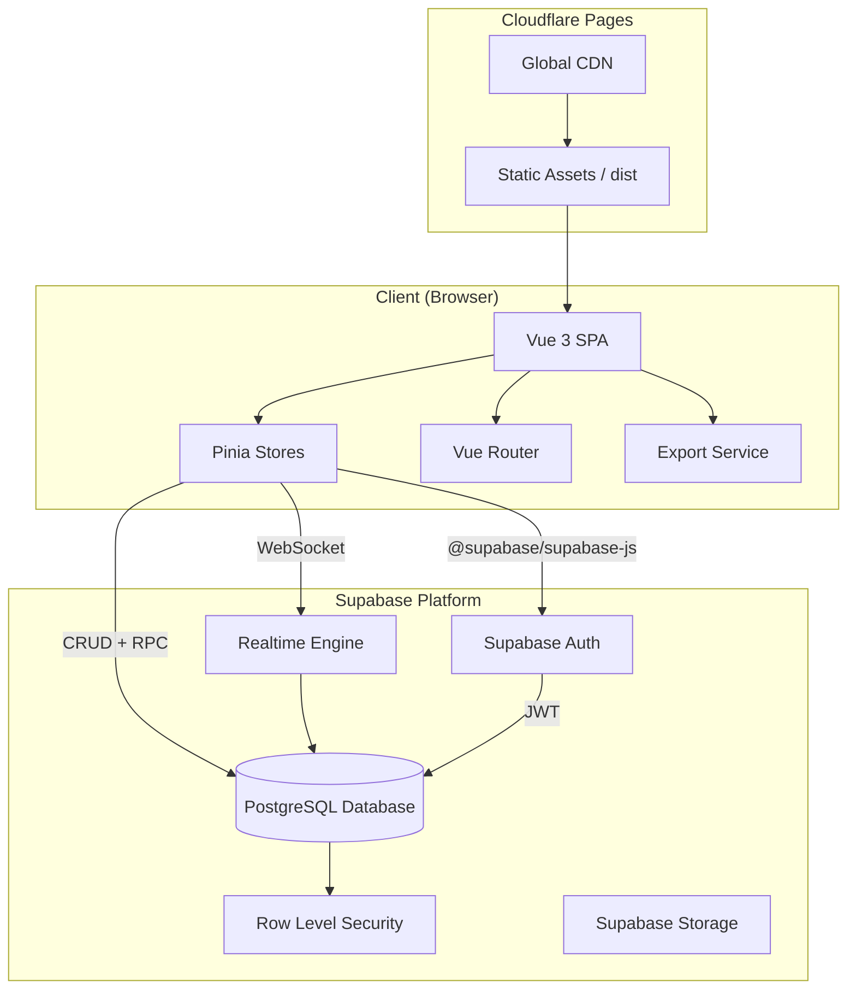
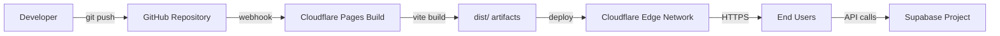
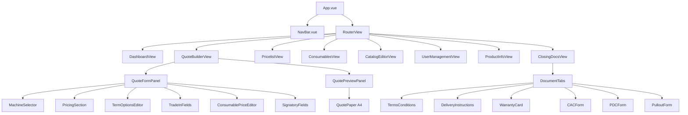
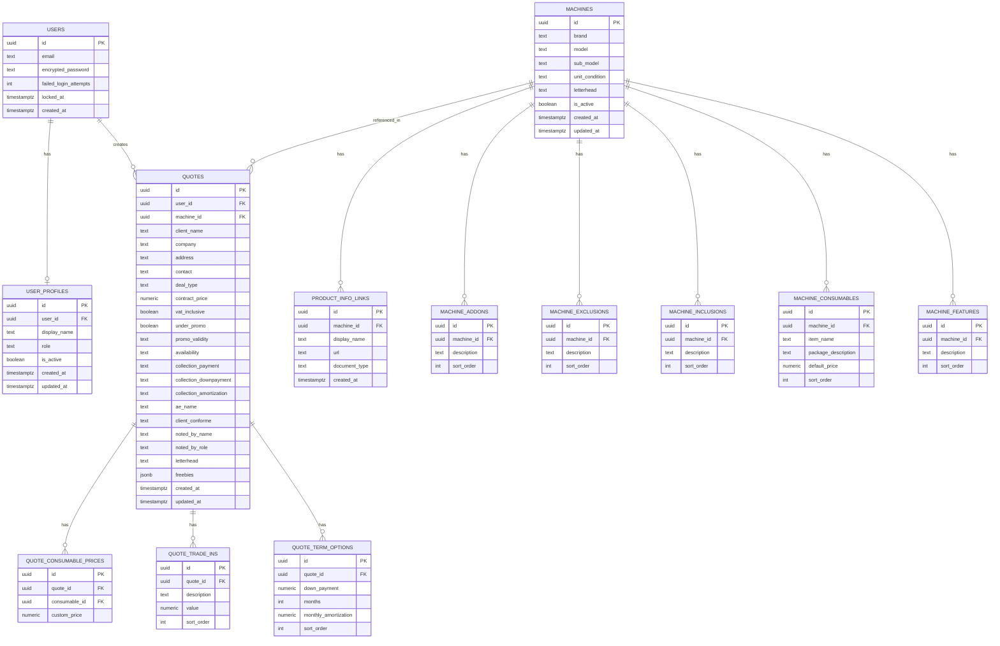
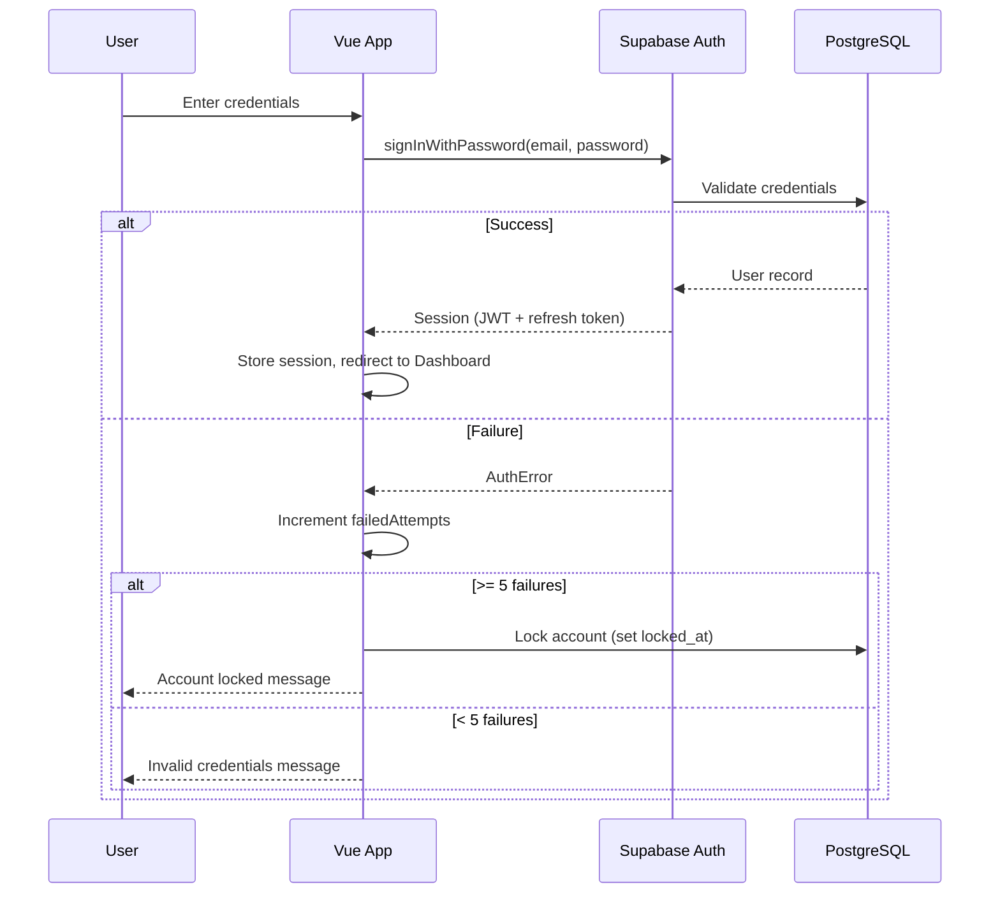
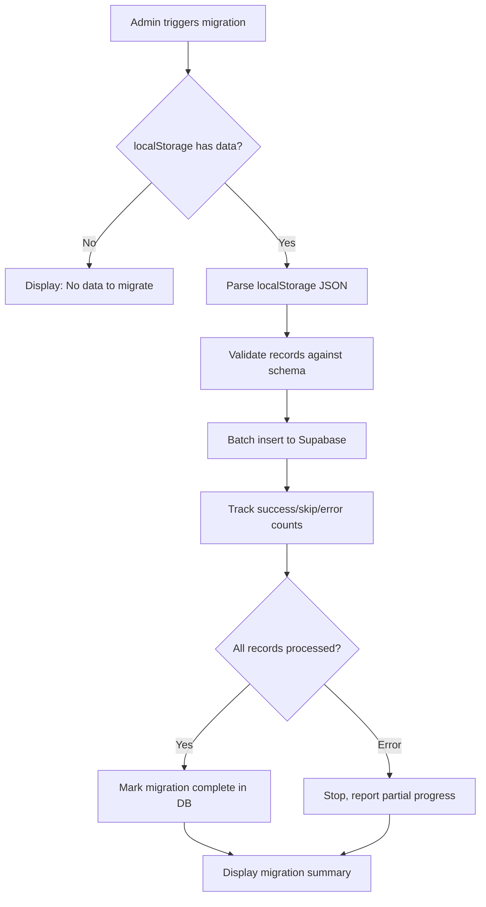

# Design Document — ESPMI Sales Portal Vue 3 Migration

## Overview

This design describes the architecture for migrating the ES Print Media Inc. (ESPMI) Sales Portal from a monolithic single-file HTML application with localStorage persistence to a modern full-stack web application. The target stack is:

- **Frontend**: Vue 3 (Composition API + `<script setup>`) with Vite as the build tool, Pinia for state management, and Vue Router for navigation
- **Backend**: Supabase (PostgreSQL database, Auth for authentication, Row Level Security for authorization, Realtime for live data synchronization)
- **Deployment**: Cloudflare Pages with Git-connected CI/CD pipeline
- **Export**: SheetJS (xlsx) for Excel generation, browser print API for PDF output

The system supports 72 concurrent authenticated users who share real-time data. The migration preserves all existing features (quote building, pricelists, closing documents, product information, user/role management) while adding proper multi-user isolation, server-side persistence, role-based access control, and real-time collaboration.

### Key Design Decisions

| Decision | Rationale |
|----------|-----------|
| Pinia over Vuex | Official Vue 3 store, simpler API, native Composition API support, TypeScript-first |
| Supabase over custom backend | Provides Auth, PostgreSQL, RLS, and Realtime out-of-the-box; eliminates need for a dedicated server |
| Cloudflare Pages over Vercel/Netlify | Requirement-specified; global CDN, zero-config SPA routing, environment variable support |
| SheetJS for Excel | Requirement-specified; client-side .xlsx generation, no server roundtrip needed |
| Browser print for PDF | Preserves exact visual fidelity with CSS `@media print`; matches existing behavior |
| Composables for service layer | Encapsulates Supabase interactions, enables reuse and testability |


---

## Architecture

### High-Level Architecture Diagram



### Deployment Architecture



### Frontend Layer Architecture

The Vue 3 application follows a layered architecture organized by feature domain:

```
src/
├── assets/                  # Static images (letterheads, icons)
├── components/
│   ├── common/              # Shared UI components (buttons, inputs, tables, modals)
│   ├── layout/              # App shell (NavBar, Sidebar, MobileBar)
│   └── [feature]/           # Feature-specific components
├── composables/             # Reusable logic (useAuth, useRealtime, useExport)
├── router/                  # Vue Router configuration and guards
├── services/                # Supabase client and API wrappers
├── stores/                  # Pinia stores (auth, catalog, quotes, users)
├── types/                   # TypeScript interfaces and types
├── views/                   # Page-level components (routed views)
├── utils/                   # Pure utility functions (formatting, calculations)
├── App.vue                  # Root component
└── main.ts                  # App entry point
```


---

## Components and Interfaces

### Vue Router Configuration

| Route Path | View Component | Auth Required | Role Required |
|------------|---------------|---------------|--------------|
| `/login` | LoginView | No | — |
| `/` | DashboardView | Yes | Any |
| `/quotes/new` | QuoteBuilderView | Yes | Any |
| `/quotes/:id` | QuoteBuilderView | Yes | Owner or Admin |
| `/quotes/:id/closing` | ClosingDocsView | Yes | Owner or Admin |
| `/pricelist` | PricelistView | Yes | Any |
| `/consumables` | ConsumablesView | Yes | Any |
| `/product-info` | ProductInfoView | Yes | Any |
| `/catalog` | CatalogEditorView | Yes | Admin |
| `/users` | UserManagementView | Yes | Admin |
| `/roles` | RoleManagementView | Yes | Admin |
| `/migrate` | DataMigrationView | Yes | Admin |

### Navigation Guard Logic

```typescript
router.beforeEach(async (to, from) => {
  const authStore = useAuthStore()
  
  if (to.meta.requiresAuth && !authStore.isAuthenticated) {
    return { name: 'login', query: { redirect: to.fullPath } }
  }
  
  if (to.meta.requiresAdmin && authStore.role !== 'admin') {
    return { name: 'dashboard' } // or show access-denied
  }
})
```

### Core Component Hierarchy




### Key Composables

| Composable | Responsibility |
|------------|---------------|
| `useAuth()` | Login, logout, password change, session monitoring, account lockout |
| `useSupabase()` | Singleton Supabase client instance |
| `useRealtime(channel, table)` | Subscribe/unsubscribe to Supabase Realtime channels |
| `useQuoteCalculations(quoteData)` | Reactive monthly amortization, totals, VAT logic |
| `useExportPDF()` | Trigger browser print dialog with correct A4 settings |
| `useExportExcel()` | Generate and download .xlsx files via SheetJS |
| `useCatalogImport()` | Parse uploaded .xlsx catalog files, validate, and batch-insert |
| `usePagination(query, pageSize)` | Offset-based pagination with reactive page state |
| `useReconnection()` | Manage Realtime disconnect detection, exponential backoff, UI warnings |

### Pinia Stores

| Store | State | Key Actions |
|-------|-------|-------------|
| `useAuthStore` | user, session, role, isAuthenticated, failedAttempts | login, logout, refreshSession, changePassword |
| `useCatalogStore` | machines, consumables, loading, error | fetchMachines, createMachine, updateMachine, softDelete, importXlsx |
| `useQuoteStore` | quotes, currentQuote, loading | fetchQuotes, saveQuote, loadQuote, deleteQuote |
| `useUserStore` | users, loading | fetchUsers, createUser, updateUser, deactivate, reactivate |
| `useDashboardStore` | monthlyQuoteCount, activeUserCount | fetchCounts, subscribeToChanges |
| `useProductInfoStore` | productLinks (grouped by brand/model) | fetchLinks, addLink, editLink, deleteLink |
| `useRealtimeStore` | connectionStatus, lastSync | connect, disconnect, handleReconnect |


### Service Layer Interfaces

```typescript
// services/supabase.ts
import { createClient } from '@supabase/supabase-js'
import type { Database } from '@/types/database'

const supabaseUrl = import.meta.env.VITE_SUPABASE_URL
const supabaseAnonKey = import.meta.env.VITE_SUPABASE_ANON_KEY

export const supabase = createClient<Database>(supabaseUrl, supabaseAnonKey)
```

```typescript
// services/auth.service.ts
export interface AuthService {
  signIn(email: string, password: string): Promise<AuthResult>
  signOut(): Promise<void>
  getSession(): Promise<Session | null>
  onAuthStateChange(callback: (event, session) => void): Subscription
  updatePassword(currentPassword: string, newPassword: string): Promise<void>
}
```

```typescript
// services/catalog.service.ts
export interface CatalogService {
  getMachines(filters?: MachineFilter): Promise<Machine[]>
  getMachineById(id: string): Promise<Machine>
  createMachine(data: MachineInput): Promise<Machine>
  updateMachine(id: string, data: MachineUpdate): Promise<Machine>
  softDeleteMachine(id: string): Promise<void>
  importFromXlsx(file: File): Promise<ImportResult>
  getConsumables(machineId?: string): Promise<Consumable[]>
}
```

```typescript
// services/quote.service.ts
export interface QuoteService {
  getQuotes(userId?: string): Promise<Quote[]>
  getQuoteById(id: string): Promise<Quote>
  saveQuote(data: QuotePayload): Promise<Quote>
  updateQuote(id: string, data: QuotePayload): Promise<Quote>
  deleteQuote(id: string): Promise<void>
  getMonthlyCount(userId: string): Promise<number>
}
```

```typescript
// services/user.service.ts
export interface UserService {
  getUsers(): Promise<UserRecord[]>
  createUser(data: CreateUserInput): Promise<UserRecord>
  updateRole(userId: string, role: Role): Promise<void>
  deactivateUser(userId: string): Promise<void>
  reactivateUser(userId: string): Promise<void>
  getActiveAdminCount(): Promise<number>
}
```


---

## Data Models

### Entity-Relationship Diagram




### PostgreSQL Schema

```sql
-- Enable UUID generation
CREATE EXTENSION IF NOT EXISTS "uuid-ossp";

-- User Profiles (extends Supabase auth.users)
CREATE TABLE user_profiles (
    id UUID PRIMARY KEY DEFAULT uuid_generate_v4(),
    user_id UUID NOT NULL REFERENCES auth.users(id) ON DELETE CASCADE,
    display_name TEXT NOT NULL CHECK (char_length(display_name) BETWEEN 1 AND 128),
    role TEXT NOT NULL DEFAULT 'salesperson' CHECK (role IN ('admin', 'salesperson')),
    is_active BOOLEAN NOT NULL DEFAULT true,
    created_at TIMESTAMPTZ NOT NULL DEFAULT now(),
    updated_at TIMESTAMPTZ NOT NULL DEFAULT now(),
    UNIQUE(user_id)
);

-- Machines catalog
CREATE TABLE machines (
    id UUID PRIMARY KEY DEFAULT uuid_generate_v4(),
    brand TEXT NOT NULL CHECK (char_length(brand) <= 100),
    model TEXT NOT NULL CHECK (char_length(model) <= 100),
    sub_model TEXT CHECK (char_length(sub_model) <= 100),
    unit_condition TEXT NOT NULL CHECK (unit_condition IN ('Brand New', 'Re-certified', 'Demo Unit')),
    letterhead TEXT NOT NULL DEFAULT 'ES Print Media Inc.' CHECK (letterhead IN ('ES Print Media Inc.', 'ACS / Alternative')),
    is_active BOOLEAN NOT NULL DEFAULT true,
    created_at TIMESTAMPTZ NOT NULL DEFAULT now(),
    updated_at TIMESTAMPTZ NOT NULL DEFAULT now(),
    UNIQUE(brand, model, COALESCE(sub_model, ''))
);

-- Machine sub-tables
CREATE TABLE machine_features (
    id UUID PRIMARY KEY DEFAULT uuid_generate_v4(),
    machine_id UUID NOT NULL REFERENCES machines(id) ON DELETE CASCADE,
    description TEXT NOT NULL,
    sort_order INT NOT NULL DEFAULT 0
);

CREATE TABLE machine_consumables (
    id UUID PRIMARY KEY DEFAULT uuid_generate_v4(),
    machine_id UUID NOT NULL REFERENCES machines(id) ON DELETE CASCADE,
    item_name TEXT NOT NULL CHECK (char_length(item_name) <= 150),
    package_description TEXT CHECK (char_length(package_description) <= 300),
    default_price NUMERIC(12,2) NOT NULL CHECK (default_price BETWEEN 0.01 AND 999999999.99),
    sort_order INT NOT NULL DEFAULT 0
);

CREATE TABLE machine_inclusions (
    id UUID PRIMARY KEY DEFAULT uuid_generate_v4(),
    machine_id UUID NOT NULL REFERENCES machines(id) ON DELETE CASCADE,
    description TEXT NOT NULL,
    sort_order INT NOT NULL DEFAULT 0
);

CREATE TABLE machine_exclusions (
    id UUID PRIMARY KEY DEFAULT uuid_generate_v4(),
    machine_id UUID NOT NULL REFERENCES machines(id) ON DELETE CASCADE,
    description TEXT NOT NULL,
    sort_order INT NOT NULL DEFAULT 0
);

CREATE TABLE machine_addons (
    id UUID PRIMARY KEY DEFAULT uuid_generate_v4(),
    machine_id UUID NOT NULL REFERENCES machines(id) ON DELETE CASCADE,
    description TEXT NOT NULL,
    sort_order INT NOT NULL DEFAULT 0
);

-- Product information links
CREATE TABLE product_info_links (
    id UUID PRIMARY KEY DEFAULT uuid_generate_v4(),
    machine_id UUID NOT NULL REFERENCES machines(id) ON DELETE CASCADE,
    display_name TEXT NOT NULL CHECK (char_length(display_name) BETWEEN 1 AND 150),
    url TEXT NOT NULL CHECK (char_length(url) <= 2048),
    document_type TEXT NOT NULL DEFAULT 'other',
    created_at TIMESTAMPTZ NOT NULL DEFAULT now()
);
```


```sql
-- Quotes
CREATE TABLE quotes (
    id UUID PRIMARY KEY DEFAULT uuid_generate_v4(),
    user_id UUID NOT NULL REFERENCES auth.users(id),
    machine_id UUID REFERENCES machines(id),
    client_name TEXT,
    company TEXT,
    address TEXT,
    contact TEXT,
    deal_type TEXT CHECK (deal_type IN ('Standard Cash', 'Standard Terms', 'Trade-In Cash', 'Trade-In Terms')),
    contract_price NUMERIC(12,2),
    vat_inclusive BOOLEAN NOT NULL DEFAULT false,
    under_promo BOOLEAN NOT NULL DEFAULT false,
    promo_validity TEXT,
    availability TEXT CHECK (char_length(availability) <= 200),
    collection_payment TEXT CHECK (char_length(collection_payment) <= 200),
    collection_downpayment TEXT CHECK (char_length(collection_downpayment) <= 200),
    collection_amortization TEXT CHECK (char_length(collection_amortization) <= 200),
    ae_name TEXT CHECK (char_length(ae_name) <= 100),
    client_conforme TEXT CHECK (char_length(client_conforme) <= 100),
    noted_by_name TEXT CHECK (char_length(noted_by_name) <= 100),
    noted_by_role TEXT CHECK (char_length(noted_by_role) <= 100),
    letterhead TEXT DEFAULT 'ES Print Media Inc.',
    freebies JSONB DEFAULT '[]'::jsonb,
    created_at TIMESTAMPTZ NOT NULL DEFAULT now(),
    updated_at TIMESTAMPTZ NOT NULL DEFAULT now()
);

CREATE TABLE quote_term_options (
    id UUID PRIMARY KEY DEFAULT uuid_generate_v4(),
    quote_id UUID NOT NULL REFERENCES quotes(id) ON DELETE CASCADE,
    down_payment NUMERIC(12,2) NOT NULL DEFAULT 0 CHECK (down_payment >= 0),
    months INT NOT NULL CHECK (months BETWEEN 1 AND 60),
    monthly_amortization NUMERIC(12,2),
    sort_order INT NOT NULL DEFAULT 0
);

CREATE TABLE quote_trade_ins (
    id UUID PRIMARY KEY DEFAULT uuid_generate_v4(),
    quote_id UUID NOT NULL REFERENCES quotes(id) ON DELETE CASCADE,
    description TEXT NOT NULL,
    value NUMERIC(12,2) NOT NULL CHECK (value >= 0),
    sort_order INT NOT NULL DEFAULT 0 CHECK (sort_order BETWEEN 0 AND 2)
);

CREATE TABLE quote_consumable_prices (
    id UUID PRIMARY KEY DEFAULT uuid_generate_v4(),
    quote_id UUID NOT NULL REFERENCES quotes(id) ON DELETE CASCADE,
    consumable_id UUID NOT NULL REFERENCES machine_consumables(id),
    custom_price NUMERIC(12,2) NOT NULL CHECK (custom_price >= 0)
);

-- Migration tracking
CREATE TABLE migration_status (
    id UUID PRIMARY KEY DEFAULT uuid_generate_v4(),
    migrated_by UUID NOT NULL REFERENCES auth.users(id),
    records_found INT NOT NULL DEFAULT 0,
    records_migrated INT NOT NULL DEFAULT 0,
    records_skipped INT NOT NULL DEFAULT 0,
    skipped_details JSONB DEFAULT '[]'::jsonb,
    status TEXT NOT NULL CHECK (status IN ('in_progress', 'completed', 'failed')),
    error_message TEXT,
    started_at TIMESTAMPTZ NOT NULL DEFAULT now(),
    completed_at TIMESTAMPTZ
);

-- Indexes for performance
CREATE INDEX idx_user_profiles_user_id ON user_profiles(user_id);
CREATE INDEX idx_user_profiles_role ON user_profiles(role);
CREATE INDEX idx_machines_brand_model ON machines(brand, model);
CREATE INDEX idx_machines_is_active ON machines(is_active);
CREATE INDEX idx_quotes_user_id ON quotes(user_id);
CREATE INDEX idx_quotes_created_at ON quotes(created_at);
CREATE INDEX idx_quotes_machine_id ON quotes(machine_id);
CREATE INDEX idx_machine_consumables_machine_id ON machine_consumables(machine_id);
CREATE INDEX idx_product_info_links_machine_id ON product_info_links(machine_id);
```


### Row Level Security Policies

```sql
-- Enable RLS on all tables
ALTER TABLE user_profiles ENABLE ROW LEVEL SECURITY;
ALTER TABLE machines ENABLE ROW LEVEL SECURITY;
ALTER TABLE machine_features ENABLE ROW LEVEL SECURITY;
ALTER TABLE machine_consumables ENABLE ROW LEVEL SECURITY;
ALTER TABLE machine_inclusions ENABLE ROW LEVEL SECURITY;
ALTER TABLE machine_exclusions ENABLE ROW LEVEL SECURITY;
ALTER TABLE machine_addons ENABLE ROW LEVEL SECURITY;
ALTER TABLE product_info_links ENABLE ROW LEVEL SECURITY;
ALTER TABLE quotes ENABLE ROW LEVEL SECURITY;
ALTER TABLE quote_term_options ENABLE ROW LEVEL SECURITY;
ALTER TABLE quote_trade_ins ENABLE ROW LEVEL SECURITY;
ALTER TABLE quote_consumable_prices ENABLE ROW LEVEL SECURITY;
ALTER TABLE migration_status ENABLE ROW LEVEL SECURITY;

-- Helper function to get user's role
CREATE OR REPLACE FUNCTION public.get_user_role()
RETURNS TEXT AS $$
  SELECT role FROM public.user_profiles WHERE user_id = auth.uid() AND is_active = true
$$ LANGUAGE sql SECURITY DEFINER STABLE;

-- USER_PROFILES policies
-- Users can read their own profile
CREATE POLICY "users_read_own_profile" ON user_profiles
    FOR SELECT USING (user_id = auth.uid());
-- Admins can read all profiles
CREATE POLICY "admins_read_all_profiles" ON user_profiles
    FOR SELECT USING (public.get_user_role() = 'admin');
-- Admins can insert/update/delete profiles
CREATE POLICY "admins_manage_profiles" ON user_profiles
    FOR ALL USING (public.get_user_role() = 'admin');

-- MACHINES policies (read: all authenticated; write: admin only)
CREATE POLICY "authenticated_read_machines" ON machines
    FOR SELECT USING (auth.uid() IS NOT NULL);
CREATE POLICY "admins_manage_machines" ON machines
    FOR ALL USING (public.get_user_role() = 'admin');

-- Machine sub-tables (same pattern: read all, write admin)
CREATE POLICY "authenticated_read_features" ON machine_features
    FOR SELECT USING (auth.uid() IS NOT NULL);
CREATE POLICY "admins_manage_features" ON machine_features
    FOR ALL USING (public.get_user_role() = 'admin');

-- (Same policies applied to machine_consumables, machine_inclusions,
--  machine_exclusions, machine_addons, product_info_links)

-- QUOTES policies
-- Users can read their own quotes
CREATE POLICY "users_read_own_quotes" ON quotes
    FOR SELECT USING (user_id = auth.uid());
-- Admins can read all quotes
CREATE POLICY "admins_read_all_quotes" ON quotes
    FOR SELECT USING (public.get_user_role() = 'admin');
-- Users can insert their own quotes
CREATE POLICY "users_insert_own_quotes" ON quotes
    FOR INSERT WITH CHECK (user_id = auth.uid());
-- Users can update their own quotes
CREATE POLICY "users_update_own_quotes" ON quotes
    FOR UPDATE USING (user_id = auth.uid());
-- Admins can manage all quotes
CREATE POLICY "admins_manage_quotes" ON quotes
    FOR ALL USING (public.get_user_role() = 'admin');

-- Quote sub-tables follow parent quote ownership
CREATE POLICY "users_manage_own_quote_terms" ON quote_term_options
    FOR ALL USING (
        EXISTS (SELECT 1 FROM quotes WHERE quotes.id = quote_id AND quotes.user_id = auth.uid())
    );
CREATE POLICY "admins_manage_quote_terms" ON quote_term_options
    FOR ALL USING (public.get_user_role() = 'admin');

-- (Same pattern for quote_trade_ins, quote_consumable_prices)

-- MIGRATION_STATUS (admin only)
CREATE POLICY "admins_manage_migration" ON migration_status
    FOR ALL USING (public.get_user_role() = 'admin');
```


### Authentication and Session Management

**Flow:**



**Account Lockout:** Implemented via a `failed_login_attempts` counter in `user_profiles` and a `locked_at` timestamp. A Supabase Edge Function (or database trigger) checks these on login and rejects locked accounts. Lockout resets on successful admin intervention.

**Session Lifecycle:**
- JWT access tokens have a 1-hour expiry (Supabase default)
- Refresh tokens extend the session transparently
- `onAuthStateChange` listener detects TOKEN_REFRESHED, SIGNED_OUT, and USER_UPDATED events
- On SIGNED_OUT or invalid token, the app redirects to `/login`

**Password Change:** Uses Supabase's `updateUser({ password })` after verifying the current password via a re-authentication step. The new password is validated client-side (8–128 characters) before submission.

### Real-Time Data Synchronization

**Strategy:** Subscribe to Supabase Realtime channels per table with Postgres Changes events. Each Pinia store manages its own subscription lifecycle.

```typescript
// composables/useRealtime.ts
export function useRealtime(tableName: string, callback: (payload) => void) {
  const channel = ref<RealtimeChannel | null>(null)
  const status = ref<'connected' | 'disconnected' | 'reconnecting'>('disconnected')

  function subscribe() {
    channel.value = supabase
      .channel(`public:${tableName}`)
      .on('postgres_changes', { event: '*', schema: 'public', table: tableName }, callback)
      .subscribe((state) => {
        status.value = state === 'SUBSCRIBED' ? 'connected' : 'reconnecting'
      })
  }

  function unsubscribe() {
    if (channel.value) supabase.removeChannel(channel.value)
  }

  return { subscribe, unsubscribe, status }
}
```

**Reconnection Logic (Requirement 11.4–11.6):**
- On disconnect, display a non-blocking warning banner
- Attempt reconnection every 5 seconds (up to 60 attempts)
- On successful reconnection, refetch stale data and remove warning
- After 60 failed attempts, show persistent error; stop retrying until manual page refresh

**Subscriptions by Feature:**
| Store | Table(s) Watched | Event Handling |
|-------|-----------------|----------------|
| `useDashboardStore` | `quotes` | Recalculate monthly count |
| `useCatalogStore` | `machines`, sub-tables | Refresh machine list |
| `useQuoteStore` | `quotes` | Update quote list for admins |
| `useUserStore` | `user_profiles` | Update user list for admins |


### Export Service Design

**PDF Export (browser print):**

```typescript
// composables/useExportPDF.ts
export function useExportPDF() {
  function printQuote() {
    // Hide form panel via CSS @media print rules
    // Set page size to A4 via @page CSS
    // Ensure print-color-adjust: exact for background colors
    window.print()
  }

  function printClosingDoc(docType: string) {
    // Show only the active closing doc tab content
    // Apply A4 formatting CSS
    window.print()
  }

  return { printQuote, printClosingDoc }
}
```

Key CSS for print fidelity:
- `@page { size: A4; margin: 8mm; }`
- `-webkit-print-color-adjust: exact; print-color-adjust: exact;` on colored elements
- `#form-panel { display: none !important }` in `@media print`
- Quote paper rendered at 210mm × 297mm with fixed dimensions

**Mobile PDF (Requirement 6.3):** On mobile, the preview panel is scaled to fit the viewport width using `transform: scale()`. For PDF export, the transform is temporarily removed so the paper renders at correct A4 dimensions regardless of viewport.

**Excel Export (SheetJS):**

```typescript
// composables/useExportExcel.ts
import * as XLSX from 'xlsx'

export function useExportExcel() {
  function exportPricelist(data: PricelistRow[], filename: string) {
    if (data.length === 0) {
      notify.warn('No data available to export')
      return
    }
    const worksheet = XLSX.utils.json_to_sheet(data)
    const workbook = XLSX.utils.book_new()
    XLSX.utils.book_append_sheet(workbook, worksheet, 'Pricelist')
    XLSX.writeFile(workbook, `${filename}.xlsx`)
  }

  return { exportPricelist }
}
```

### Data Migration Strategy

**One-time migration utility (Requirement 12):**



**Implementation details:**
- Reads `localStorage` keys used by the existing app (machines catalog, user list)
- Maps old schema to new PostgreSQL schema
- Uses Supabase batch insert with ON CONFLICT handling for duplicates
- Tracks counts: found, migrated, skipped (with reason per skip)
- On success, writes a `migration_status` record with `status: 'completed'`
- Does NOT delete localStorage data (preserves as fallback)
- Subsequent loads check `migration_status` and skip if completed
- Accessible only via `/migrate` route (admin-gated)

### Deployment Pipeline


**Build Configuration:**
- Framework preset: None (custom Vite)
- Build command: `npm run build` (which runs `vite build`)
- Output directory: `dist`
- Node.js version: 18.x (or latest LTS)

**Environment Variables (Cloudflare Pages):**
| Variable | Purpose |
|----------|---------|
| `VITE_SUPABASE_URL` | Supabase project URL |
| `VITE_SUPABASE_ANON_KEY` | Supabase anonymous/public key |

These are prefixed with `VITE_` so Vite injects them at build time via `import.meta.env`. They are NOT hardcoded in source files.

**SPA Routing:** Cloudflare Pages configured with `/* → /index.html` redirect rule (or `_redirects` file) to support Vue Router's history mode.

**Zero-downtime deployment:** Cloudflare Pages performs atomic deploys — the new version replaces the old atomically at the edge. Previous builds are retained as rollback targets.


---

## Correctness Properties

*A property is a characteristic or behavior that should hold true across all valid executions of a system — essentially, a formal statement about what the system should do. Properties serve as the bridge between human-readable specifications and machine-verifiable correctness guarantees.*

### Prework: Acceptance Criteria Testing Analysis

**Criteria amenable to Property-Based Testing:**

1.6 Display name truncation
  Thoughts: This is a pure string transformation — truncate to 50 characters. For any display name string, the output should never exceed 50 characters and should equal the original if the original is ≤ 50 characters. Input space is all strings.
  Classification: PROPERTY

1.8 Password change validation
  Thoughts: For any new password string, it should be accepted if and only if it is between 8 and 128 characters. This is a pure validation function over the space of all strings.
  Classification: PROPERTY

2.1/2.2 Role enforcement
  Thoughts: For any authenticated user, they should always have exactly one of two roles. If no recognized role exists, default to salesperson. This is a pure mapping function.
  Classification: PROPERTY

4.7 Duplicate brand-model-sub_model rejection
  Thoughts: For any two machine records, if they share the same (brand, model, sub_model) tuple, the second should be rejected. This is a uniqueness constraint that holds universally across all inputs.
  Classification: PROPERTY

5.3 Monthly amortization calculation
  Thoughts: This is a pure arithmetic function: (contract_price - down_payment - trade_in_sum) / months, rounded to 2 decimal places. The input space is large (all valid numeric combinations). Behavior varies with every input combination. This is the strongest PBT candidate.
  Classification: PROPERTY

5.4 Invalid amortization inputs
  Thoughts: For any inputs where months = 0 OR (down_payment + trade_in_sum >= contract_price), the system should reject and not compute. This is a validation guard over numeric inputs.
  Classification: PROPERTY

5.7 Term options constraint (1–5 options, months 1–60)
  Thoughts: For any quote, the number of term options should be between 1 and 5. For any term option, months should be between 1 and 60. Each option's amortization is computed independently. This is testable across all valid/invalid combinations.
  Classification: PROPERTY

5.17 Quote save/load round-trip
  Thoughts: For any valid quote payload, saving and then loading should produce an equivalent quote object. This is a classic round-trip property (serialization/deserialization).
  Classification: PROPERTY

6.5 Excel export column correctness
  Thoughts: For any set of pricelist rows, the exported .xlsx should contain all rows with column headers matching the visible table columns. We can generate random pricelist data and verify the exported structure matches.
  Classification: PROPERTY

10.1 Username validation
  Thoughts: For any string, it should be accepted as a username if and only if it is 3–64 characters and contains only alphanumeric characters and underscores. This is a pure validation function over all strings.
  Classification: PROPERTY

10.6 Minimum admin constraint
  Thoughts: For any set of users, deactivating an admin should be rejected if it would leave zero active admins. This is an invariant that must hold after every mutation.
  Classification: PROPERTY

12.2 Migration record counting
  Thoughts: For any set of localStorage records, the sum of (migrated + skipped) should equal the total found. This is an invariant (conservation of records).
  Classification: PROPERTY

**Criteria classified as EXAMPLE, EDGE_CASE, INTEGRATION, or SMOKE (not suitable for PBT):**

- 1.1 (INTEGRATION — timing/session establishment with Supabase Auth)
- 1.3 (EXAMPLE — specific threshold of 5 attempts)
- 1.4, 1.5, 1.7, 1.9 (INTEGRATION — session/redirect behavior)
- 2.3–2.5 (EXAMPLE — specific UI rendering behavior)
- 2.6 (INTEGRATION — RLS policy enforcement in Supabase)
- 2.7 (INTEGRATION — role propagation timing)
- 3.1–3.7 (EXAMPLE/INTEGRATION — dashboard rendering and realtime)
- 4.1–4.6, 4.8–4.10 (INTEGRATION — Supabase persistence and import)
- 5.1, 5.2, 5.5, 5.6, 5.8–5.16 (EXAMPLE — UI behavior)
- 6.1–6.4, 6.6–6.8 (INTEGRATION — browser print/PDF behavior)
- 7.1–7.6 (EXAMPLE/INTEGRATION — table rendering, realtime propagation)
- 8.1–8.6 (EXAMPLE — closing docs UI behavior)
- 9.1–9.7 (EXAMPLE — product info UI)
- 10.2–10.5, 10.7–10.8 (INTEGRATION/EXAMPLE)
- 11.1–11.6 (INTEGRATION — realtime/WebSocket behavior)
- 12.1, 12.3–12.6 (INTEGRATION/EXAMPLE — migration flow)
- 13.1–13.6 (SMOKE — deployment/infrastructure checks)
- 14.1–14.6 (EXAMPLE — CSS/responsive layout testing)


### Reflection on Properties

Reviewing all identified properties for redundancy:

1. **Display name truncation (1.6)** — unique; tests string capping logic
2. **Password validation (1.8)** — unique; tests length-range validation
3. **Role enforcement (2.1/2.2)** — unique; tests default-role assignment
4. **Duplicate machine rejection (4.7)** — unique; tests uniqueness constraint
5. **Amortization calculation (5.3)** — unique; tests core arithmetic formula
6. **Invalid amortization guard (5.4)** — could be considered an edge case of #5, but it tests a distinct validation path (guard condition) rather than computation correctness. **Keep as separate property.**
7. **Term options constraint (5.7)** — unique; tests cardinality and range constraints
8. **Quote round-trip (5.17)** — unique; classic round-trip property
9. **Excel export structure (6.5)** — unique; tests data-to-spreadsheet mapping
10. **Username validation (10.1)** — similar to password validation in pattern (string regex validation), but validates different constraints. **Keep separate.**
11. **Minimum admin invariant (10.6)** — unique; tests state invariant after mutation
12. **Migration record conservation (12.2)** — unique; tests counting invariant

**No redundant properties found.** Each validates a distinct aspect of the system. Proceeding with all 12 properties.

---

### Property 1: Display Name Truncation

*For any* string used as a display name, the truncated output SHALL have length ≤ 50 characters, AND if the original string length is ≤ 50, the output SHALL equal the original string exactly.

**Validates: Requirements 1.6**

### Property 2: Password Length Validation

*For any* string submitted as a new password, the validation function SHALL accept it if and only if its length is between 8 and 128 characters inclusive.

**Validates: Requirements 1.8**

### Property 3: Role Default Assignment

*For any* authenticated user profile, the resolved role SHALL always be exactly one of `'admin'` or `'salesperson'`. If the stored role value is null, empty, or any unrecognized string, the resolved role SHALL be `'salesperson'`.

**Validates: Requirements 2.1, 2.2**

### Property 4: Machine Uniqueness Constraint

*For any* two Machine records, if they share the same (brand, model, sub_model) tuple (treating null sub_model as empty string for comparison), the system SHALL reject the second record with a validation error.

**Validates: Requirements 4.7**

### Property 5: Monthly Amortization Calculation

*For any* valid quote inputs where `months > 0` AND `(down_payment + trade_in_sum) < contract_price`, the computed monthly amortization SHALL equal `Math.round(((contract_price - down_payment - trade_in_sum) / months) * 100) / 100` (rounded to exactly two decimal places).

**Validates: Requirements 5.3**

### Property 6: Amortization Validation Guard

*For any* quote inputs where `months === 0` OR `(down_payment + trade_in_sum) >= contract_price`, the amortization computation function SHALL return an error/invalid result and SHALL NOT produce a numeric amortization value.

**Validates: Requirements 5.4**

### Property 7: Term Option Cardinality and Range

*For any* quote, the number of term options SHALL be between 1 and 5 inclusive. *For any* individual term option, the months value SHALL be between 1 and 60 inclusive, the down payment SHALL be ≥ 0, and the monthly amortization SHALL be computed independently using Property 5's formula.

**Validates: Requirements 5.7**

### Property 8: Quote Save/Load Round-Trip

*For any* valid quote payload object, saving it to the database and then loading it by ID SHALL produce a quote object with all field values equivalent to the original payload (within expected type coercions for timestamps).

**Validates: Requirements 5.17**

### Property 9: Excel Export Data Integrity

*For any* non-empty array of pricelist row objects, the generated .xlsx workbook SHALL contain exactly one sheet with a header row matching the input object keys, and the number of data rows SHALL equal the length of the input array, with each cell value matching the corresponding input field.

**Validates: Requirements 6.5**

### Property 10: Username Validation

*For any* string submitted as a username, the validation function SHALL accept it if and only if it matches the pattern `^[a-zA-Z0-9_]{3,64}$`.

**Validates: Requirements 10.1**

### Property 11: Minimum Admin Invariant

*For any* set of user profiles and any deactivation request targeting an admin user, the deactivation SHALL be rejected if the count of active admin users (excluding the target) would be zero.

**Validates: Requirements 10.6**

### Property 12: Migration Record Conservation

*For any* set of records processed by the migration utility, the sum of `records_migrated + records_skipped` SHALL equal `records_found`. No records are created or lost during processing.

**Validates: Requirements 12.2**


---

## Error Handling

### Error Handling Strategy

The application uses a layered error handling approach:

1. **Service Layer** — Catches Supabase client errors, normalizes them into typed error objects
2. **Store Layer** — Sets error state in Pinia stores, triggers UI notifications
3. **Component Layer** — Displays contextual error messages with retry actions
4. **Global Handler** — Catches unhandled promise rejections and Vue error boundaries

### Error Types

```typescript
// types/errors.ts
export type AppErrorCode =
  | 'AUTH_INVALID_CREDENTIALS'
  | 'AUTH_ACCOUNT_LOCKED'
  | 'AUTH_SESSION_EXPIRED'
  | 'AUTH_UNAUTHORIZED'
  | 'VALIDATION_ERROR'
  | 'DUPLICATE_RECORD'
  | 'NETWORK_ERROR'
  | 'REALTIME_DISCONNECTED'
  | 'IMPORT_INVALID_FILE'
  | 'IMPORT_SCHEMA_MISMATCH'
  | 'IMPORT_SIZE_EXCEEDED'
  | 'EXPORT_NO_DATA'
  | 'EXPORT_FAILED'
  | 'SAVE_FAILED'
  | 'LOAD_FAILED'
  | 'MIGRATION_FAILED'
  | 'ADMIN_MINIMUM_VIOLATION'

export interface AppError {
  code: AppErrorCode
  message: string           // User-facing message
  details?: string          // Technical details (for logging)
  retryable: boolean        // Whether the user can retry the operation
  field?: string            // Specific field that caused validation failure
}
```

### Error Handling per Feature

| Feature | Error Scenario | User Experience |
|---------|---------------|-----------------|
| Login | Invalid credentials | Inline error below form, increment counter |
| Login | Account locked | Inline error indicating lock, no retry |
| Session | Token expired | Auto-redirect to login with return URL |
| Dashboard | Data load failure | Error card with "Retry" button |
| Dashboard | Realtime disconnect | Yellow banner: "Data may be outdated" |
| Catalog | Save failure (rollback) | Toast error identifying failed sub-record |
| Catalog | Duplicate machine | Inline validation error on brand/model fields |
| Catalog Import | File too large/bad schema | Modal error with specific rejection reason |
| Quote Builder | Catalog unavailable | Disabled form with error message + retry |
| Quote Builder | Save failure | Toast error, form data preserved |
| Quote Builder | Invalid amortization inputs | Inline validation on affected fields |
| Export PDF | Print dialog blocked | Toast: "Export failed. Check browser popup settings" |
| Export Excel | No data | Toast: "No data available to export" |
| User Mgmt | Duplicate username | Inline error on username field |
| User Mgmt | Last admin deactivation | Modal: "Cannot deactivate the last admin" |
| Migration | Network/DB error mid-run | Error page with partial progress count |
| Migration | No localStorage data | Info message: "No data to migrate" |
| Realtime | 60 reconnection failures | Persistent red banner, manual refresh required |

### Retry Strategy

- **Automatic retries**: Network errors on data fetches use exponential backoff (1s, 2s, 4s) up to 3 attempts before showing error UI
- **Manual retries**: All error states that display messages include a "Retry" button that re-invokes the failed operation
- **Realtime reconnection**: Fixed 5-second interval, max 60 attempts (per Requirement 11.4)

### Error Boundaries

```typescript
// App.vue uses Vue's onErrorCaptured lifecycle hook
onErrorCaptured((err, instance, info) => {
  // Log to console (and optionally to a monitoring service)
  console.error('[App Error]', err, info)
  // Display generic toast for uncaught errors
  notify.error('An unexpected error occurred. Please try again.')
  return false // prevent propagation
})
```


---

## Testing Strategy

### Dual Testing Approach

The project uses two complementary testing strategies:

1. **Unit Tests (example-based)** — Verify specific scenarios, edge cases, integration points, and UI behavior
2. **Property Tests** — Verify universal correctness properties across all valid inputs using randomized generation

### Testing Stack

| Tool | Purpose |
|------|---------|
| **Vitest** | Test runner (Vite-native, fast, watch mode) |
| **fast-check** | Property-based testing library for TypeScript |
| **Vue Test Utils** | Component mounting and interaction testing |
| **@testing-library/vue** | User-centric component testing |
| **MSW (Mock Service Worker)** | API mocking for integration tests |
| **Playwright** | E2E tests for critical user flows |

### Property-Based Tests

Each correctness property (Section above) is implemented as a property-based test using `fast-check`. Configuration:

- **Minimum 100 iterations** per property test (fast-check default is 100)
- Each test is tagged with a comment referencing the design property
- Tag format: **Feature: sales-portal-vue-migration, Property {number}: {property_text}**

```typescript
// Example: Property 5 — Monthly Amortization Calculation
import { fc } from '@fast-check/vitest'
import { computeAmortization } from '@/utils/quote-calculations'

// Feature: sales-portal-vue-migration, Property 5: Monthly Amortization Calculation
fc.test.prop(
  [
    fc.float({ min: 1, max: 999999999, noNaN: true }),      // contractPrice
    fc.float({ min: 0, max: 999999999, noNaN: true }),      // downPayment
    fc.float({ min: 0, max: 999999999, noNaN: true }),      // tradeInSum
    fc.integer({ min: 1, max: 60 }),                         // months
  ],
  'amortization equals (price - down - tradeIn) / months rounded to 2dp',
  (contractPrice, downPayment, tradeInSum, months) => {
    fc.pre(downPayment + tradeInSum < contractPrice) // precondition
    
    const result = computeAmortization(contractPrice, downPayment, tradeInSum, months)
    const expected = Math.round(((contractPrice - downPayment - tradeInSum) / months) * 100) / 100
    
    expect(result).toBeCloseTo(expected, 2)
  }
)
```

```typescript
// Example: Property 8 — Quote Save/Load Round-Trip
// Feature: sales-portal-vue-migration, Property 8: Quote Save/Load Round-Trip
fc.test.prop(
  [arbitraryQuotePayload()], // custom arbitrary generating valid quote objects
  'saving then loading a quote preserves all fields',
  async (quotePayload) => {
    const saved = await quoteService.saveQuote(quotePayload)
    const loaded = await quoteService.getQuoteById(saved.id)
    
    expect(loaded).toMatchObject(quotePayload)
  }
)
```

### Unit Test Coverage Areas

| Area | Tests | Focus |
|------|-------|-------|
| Auth composable | Login flow, logout, session expiry detection | Specific scenarios with mocked Supabase |
| Navigation guards | Route protection for admin/salesperson roles | Specific role combinations |
| Quote Builder UI | Form interactions, field population, preview updates | User interaction testing |
| Closing Documents | Tab switching preserves data, pre-population from quote | Specific document types |
| Pricelist | Sorting, filtering, pagination | Specific filter scenarios |
| Catalog Editor | Form validation, CRUD operations | Specific field constraints |
| Mobile responsiveness | Tab switching preserves data, viewport adaptation | Specific breakpoints |
| Error handling | Each error type produces correct UI feedback | Specific error scenarios |
| Realtime | Connection/disconnection state management | Specific state transitions |
| Migration | Happy path, partial failure, empty localStorage | Specific scenarios |

### Integration Tests

Integration tests verify the full stack from component through Supabase (using a test project or local Supabase instance):

- Auth flow: login → session → API call → logout
- RLS enforcement: salesperson cannot access admin tables
- Realtime: catalog update propagates to subscribed client
- Quote lifecycle: create → save → load → update → delete
- Catalog import: upload .xlsx → parse → validate → insert

### E2E Tests (Playwright)

Critical user journeys tested end-to-end:

1. Login → Dashboard → Create Quote → Save → Export PDF
2. Admin: Create User → Assign Role → Verify access restrictions
3. Admin: Import catalog .xlsx → Verify pricelist updates
4. Mobile: Quote Builder form → Switch to preview → Save as PDF
5. Realtime: Two sessions — one saves quote, other sees update

### Test File Organization

```
tests/
├── unit/
│   ├── utils/
│   │   ├── quote-calculations.spec.ts
│   │   ├── validators.spec.ts
│   │   └── display-name.spec.ts
│   ├── composables/
│   │   ├── useAuth.spec.ts
│   │   ├── useRealtime.spec.ts
│   │   └── useExportExcel.spec.ts
│   ├── stores/
│   │   ├── auth.spec.ts
│   │   ├── catalog.spec.ts
│   │   └── quotes.spec.ts
│   └── components/
│       ├── QuoteFormPanel.spec.ts
│       ├── MachineSelector.spec.ts
│       └── NavBar.spec.ts
├── property/
│   ├── amortization.property.ts
│   ├── validators.property.ts
│   ├── quote-roundtrip.property.ts
│   ├── excel-export.property.ts
│   └── migration-conservation.property.ts
├── integration/
│   ├── auth-flow.spec.ts
│   ├── rls-policies.spec.ts
│   ├── catalog-crud.spec.ts
│   └── realtime-sync.spec.ts
└── e2e/
    ├── quote-lifecycle.spec.ts
    ├── admin-user-management.spec.ts
    ├── catalog-import.spec.ts
    └── mobile-quote-builder.spec.ts
```

